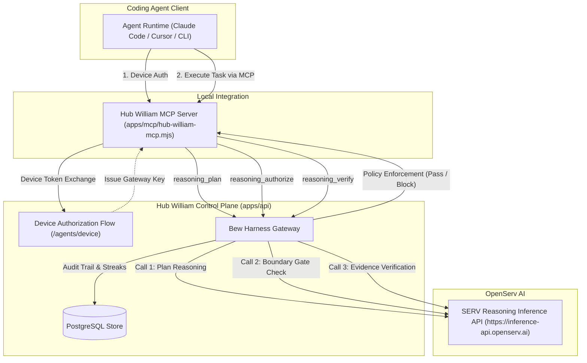

# OpenServ SERV Hackathon #1 Submission Kit: Memwal Guard

Submission dossier for **Memwal Guard — a reasoning control plane for autonomous coding agents** (Open Track).
Deadline: **Monday 28/09 07:00 VN time**.

---

## 1. Submission Checklist

Ordered execution checklist for final submission:

- [ ] **Account Setup**: Sign up at https://console.openserv.ai/signup
- [ ] **Generate API Key**: Navigate to Settings → Keys in OpenServ Console and create a new reasoning API key.
- [ ] **Backend Configuration**: Set `SERV_REASONING_API_KEY` and `SERV_REASONING_URL=https://inference-api.openserv.ai` in `apps/api/.env`.
- [ ] **Mandatory Telemetry Opt-in**: ENABLE data collection at https://console.openserv.ai/settings/organization (mandatory — entries without telemetry enabled are disqualified).
- [ ] **Live Telemetry Recording**: Run the agent end-to-end at least once against SERV so live usage records on the OpenServ dashboard:
  ```bash
  curl -s -X POST https://api-memwal.up.railway.app/reasoning/plan \
    -H "Authorization: Bearer <GATEWAY_KEY>" \
    -H "Content-Type: application/json" \
    -d '{"task":"Refactor auth middleware to enforce boundary gating","available_skills":["frontend-convention","delivery-verify"]}'
  ```
- [ ] **Production Deployment**: Verify live deployment links for both backend (Railway) and frontend (Vercel).
- [ ] **Social Announcement**: Publish post on X tagging `@openservai` with demo and repository links.
- [ ] **Official Form Submission**: Complete and submit https://form.typeform.com/to/A475N331 before the deadline.

---

## 2. One-Liner for Typeform

> "Before SERV my agent hallucinated plans, edited out-of-scope files, and claimed success without proof. With SERV every task passes plan → boundary gate → evidence verification — 3 reasoning calls per task, fully auditable."

---

## 3. X Post Draft

Target length: $\le 280$ characters. Includes `@openservai` tag, feature summary, and demo/repo placeholders.

```text
Introducing Memwal Guard: a 3-checkpoint reasoning control plane for coding agents powered by @openservai.

Guarantees safe coding via plan -> boundary gate -> evidence verification.

Live Demo: <LIVE_DEMO_URL>
Repo: https://github.com/harrymove-ctrl/memwal-hub
```

---

## 4. Typeform Answers Draft

* **Account Email**: `<YOUR_REGISTERED_OPENSERV_EMAIL>` (must match OpenServ console registration)
* **Track**: Open Track
* **X / Twitter Post Link**: `<YOUR_X_POST_URL>`
* **Project Description**:
  Memwal Guard (part of Hub William) is an auditable reasoning control plane and guard layer ("Bew Harness") built for autonomous coding agents. Powered by OpenServ SERV reasoning, every agent task is governed across three mandatory checkpoints: structured planning, out-of-scope diff boundary gating, and objective test evidence verification before pushing code. Operators get complete visibility through live compliance streaks, device authorization flows, and zero-trust audit trails.
* **Live Demo URL**: `<LIVE_DEMO_URL>`
* **Source Repository**: https://github.com/harrymove-ctrl/memwal-hub
* **Logo Asset**: Brand mark SVG and icon assets are packaged in repository web assets (`apps/frontend/public/` and dashboard navbar header).

---

## 5. Live Deployment (Railway + Vercel)

### Backend Deployment (Railway)
The backend is packaged via `apps/api/Dockerfile` connected to a Railway PostgreSQL database service.

#### Required Environment Variables
| Variable | Description / Expected Value |
|---|---|
| `DATABASE_URL` | PostgreSQL connection URI provided by Railway (`${{Postgres.DATABASE_URL}}`) |
| `FRONTEND_ORIGIN` | Production web application origin (e.g. `https://memwal-guard.vercel.app`) |
| `PROVIDER_CREDENTIAL_ENCRYPTION_KEY` | Base64url-encoded 32-byte secret key for credential storage |
| `GEMINI_OAUTH_CLIENT_SECRET` | Google OAuth client secret for Gemini provider subscription gateway |
| `SERV_REASONING_API_KEY` | Secret API key created at OpenServ console |
| `SERV_REASONING_URL` | Base API URL: `https://inference-api.openserv.ai` |
| `SERV_REASONING_MODEL` | Reasoner model identifier (default: `serv-reason-1`) |
| `PORT` | Listening port (default: `8080`) |

Generate `PROVIDER_CREDENTIAL_ENCRYPTION_KEY`:
```bash
openssl rand -base64 32 | tr '/+' '_-' | tr -d '='
```

### Frontend Deployment (Vercel)
Deploy `apps/frontend` using Vercel CLI or Git integration. Single-page client rewrites are governed by `vercel.json`.

| Variable | Description / Expected Value |
|---|---|
| `VITE_API_BASE_URL` | Public Railway API service endpoint (e.g. `https://api-memwal.up.railway.app`) |

---

## 6. 90-Second Video Demo Script

* **[0:00 - 0:15] Problem Hook**:
  "Autonomous coding agents running on raw LLMs suffer from three critical flaws: they hallucinate multi-step plans, modify out-of-scope files silently, and declare tests passed without verification. Memwal Guard solves this by inserting a 3-checkpoint SERV reasoning control plane into the agent execution loop."
* **[0:15 - 0:40] Run Task With SERV**:
  "Open `/activities` and select **Run Task With SERV**. Watch the control plane trigger 3 distinct SERV reasoning checkpoints:
  1. *Plan Checkpoint*: SERV validates task decomposition, dependencies, and risk scope.
  2. *Bew Harness Boundary Gate*: Inspects proposed diffs against policy; out-of-scope edits or unauthorized branch pushes are blocked immediately.
  3. *Evidence Verification*: SERV evaluates raw test outputs and compiler exit codes before certifying the task as done."
* **[0:40 - 0:55] Comparison (Without SERV)**:
  "Now toggle to *Without SERV*. The unguided agent attempts unconstrained modifications, misses regression boundaries, and flags arbitrary success without objective proof."
* **[0:55 - 1:10] Audit Trail & Streak Grid**:
  "Inspect the audit trail and streak grid on `/activities`. Every checkpoint records cryptographic validation, SERV reasoning latency, token consumption, and safety adherence."
* **[1:10 - 1:30] Device Flow & MCP Integration**:
  "Navigate to `/agents` to initiate the Device Authorization flow. Any coding agent—Claude Code, Cursor, or Codex—integrates via our zero-dependency stdio MCP server (`apps/mcp/hub-william-mcp.mjs`). Four unified tools (`authorize_device`, `reasoning_plan`, `reasoning_authorize`, `reasoning_verify`) make agent governance plug-and-play."

```json
{
  "mcpServers": {
    "hub-william": {
      "command": "node",
      "args": ["apps/mcp/hub-william-mcp.mjs"],
      "env": {
        "HUB_URL": "https://api-memwal.up.railway.app"
      }
    }
  }
}
```

---

## 7. Judging Criteria Mapping

| Judging Criterion | Evidence & Implementation |
|---|---|
| **Creativity** | Purpose-built policy control plane and verification harness for autonomous coding agents rather than another generic conversational chatbot wrapper. |
| **User-Ready** | Fully deployed live web application with an auditable control panel, device authorization flow, and a 3-line MCP server integration (`apps/mcp/hub-william-mcp.mjs`) compatible with leading agent workbenches. |
| **Revenue Potential** | Enterprise per-seat governance SaaS model; constraining task verification to exactly 3 deterministic SERV reasoning calls per task keeps inference margins predictable and unit economics defensible. |

---

## 8. Architecture



---

## 9. Known Limitations (accepted for single-operator demo)

- `GET /agent-auth/device/pending` lists all pending device requests globally. Fine for a single-operator deployment; multi-tenant production should drop the listing and require manual `user_code` entry (RFC 8628 proof-of-possession).
- The Activities settings drawer stores gateway/SERV keys in browser `localStorage` for demo convenience; production should authenticate reasoning calls with the session cookie instead.
