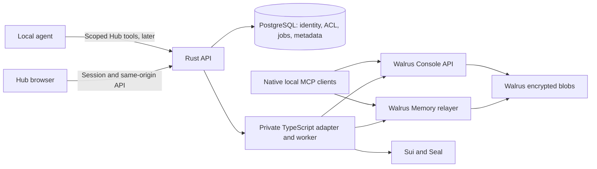

# Walrus Memory and Walrus Console integration specification

Research date: 4 October 2026 (Asia/Ho_Chi_Minh). Status: proposed; no integration has been deployed.

## 1. Recommendation

Add two complementary capabilities to MemWal (the current application in `memwal-hub`):

- **Memory:** save and recall durable preferences, project decisions, constraints, and useful facts through Walrus Memory.
- **Files:** store and retrieve source documents, reports, attachments, and memory exports through Walrus Console.

Keep the application database authoritative for identity, authorization, jobs, source links, and current settings. Use Walrus Memory for semantic recall and Console for encrypted artifacts. Neither replaces that database or the repository-backed public catalogue.

Ship native MCP onboarding first, then an integrated Hub UI/API. Use a private Node.js/TypeScript adapter alongside the existing Rust API for the official Memory SDK and Console's Sui/Seal operations. Prefer user-owned connections; do not put all production users behind one account-wide delegate key.

**Important availability constraint:** Console is documented as an invite-only Mainnet beta. Files, API keys, MCP, and automatic file renewal are beta features. Its memory asset UI is listed for GA; memory renewal and Team Spaces are post-GA. The Hub must work without those future features. [S1–S4]

## 2. Scope and assumptions

This specification interprets the request as integrating the official Walrus Memory and Walrus Console products into this repository, with a local-agent setup option. It describes an implementable design, not functionality already present.

Assumptions:

- Existing Hub username/password sessions remain the primary application login.
- Individual users bring their own Walrus Memory account and, when available, Console credentials.
- Users explicitly choose what to save or index. Raw gateway conversations are not captured automatically.
- Hub-managed mode allows the Hub backend to process plaintext. A separate local MCP mode keeps Console file encryption on the user's computer.
- Team memory sharing, custodial account creation, automatic conversation capture, and strict browser-only encryption are later features.
- Numeric Hub quotas and latency budgets below are initial proposed product defaults, not vendor guarantees.

## 3. Research findings and verified product boundaries

| Topic | Documented behavior | Consequence for Hub |
| --- | --- | --- |
| Memory storage | Encrypted blobs on Walrus, ownership/delegates on Sui, search/indexing through a relayer | Preserve remote identifiers and surface storage/indexing separately |
| Managed Memory | Relayer receives plaintext and generates embeddings/encryption; recall returns plaintext | Disclose this trust model; do not call it end-to-end encrypted against the relayer |
| Manual Memory | Client manages embeddings and Seal; relayer receives ciphertext and vectors | Possible later privacy mode; embedding provider remains a separate trust consideration |
| Memory namespace | Exact organization scope under an account; delegate can access every namespace in its account | A namespace is not a cryptographic tenant boundary |
| Console authentication | `hbr_` bearer API key plus `suiprivkey1` service key for signing/decryption | Store the pair securely; an API key alone is insufficient for the full encrypted workflow |
| Console key roles | `read_only`, `read_write`, `key_admin`; management keys cannot operate assets | Reject a management key for ordinary file connections |
| Console private files | Encrypt before upload; download returns ciphertext | Encryption belongs in the integration client, not a presumed Console server feature |
| Console search | File/metadata search is documented | Do not claim semantic search of encrypted file contents |
| Console limits | 5 GB and five folders per space; 100 MiB per upload | Reuse a folder per integration; validate encrypted payload size |
| Storage lifetime | Walrus storage expires; Console auto-renews its files | Do not assume Console renews Walrus Memory records |
| Console identities | Google and Apple produce separate accounts; Memory and Console can also derive different Sui addresses | Never link accounts by matching email |
| Memory writes | Accepted asynchronously; `done` can precede search visibility | `202` means accepted, not saved and searchable |
| Memory deletion | `/api/forget` removes namespace index rows; blobs remain and restore can recover them | Never label forget as permanent erasure |

Sources: [S1–S12]. Live documentation may describe development features ahead of deployed releases; authenticated behavior still needs a staging proof.

### Version snapshot

The npm registry returned these tags on the research date:

| Package | Observed tag |
| --- | --- |
| `@mysten-incubation/memwal` | `latest: 0.1.8` |
| `@mysten-incubation/memwal-mcp` | `latest: 0.0.14` |
| `@mysten-incubation/walrus-console-mcp` | `beta: 0.1.0-beta.0`; `latest: 0.0.0` |

Use an exact tested version and lockfile, not an unqualified Console `latest`. Console MCP requires Node.js 24+. The Console API walkthrough requires Node.js 22+; standardize the proposed adapter on Node.js 24 LTS. Memory's manual-flow docs identify compatible peer families `@mysten/sui ^2.16.2`, `@mysten/seal ^1.1.3`, `@mysten/walrus ^1.1.7`; resolve and test one compatible set before shipping. [S3, S4, S5, S16]

## 4. Existing project and integration points

The repository currently provides React 19/React Router, a Rust Axum API, PostgreSQL sessions, encrypted provider credentials, provider pools, and a streaming gateway. Runtime browser requests use the same-origin `/api` proxy. The catalogue remains build-time Markdown. `/activities` still contains fixture telemetry.

Relevant existing files:

- `apps/api/src/lib.rs`: route composition and shared state.
- `apps/api/src/auth.rs`: application authentication.
- `apps/api/src/config.rs`: runtime configuration.
- `apps/api/src/openapi.rs`: generated API contract.
- `apps/frontend/src/services/`: typed browser API clients.
- `apps/frontend/src/components/workspace-shell/`: navigation and account state.
- `apps/frontend/scripts/machine/`: installation and MCP configuration.
- `docs/decisions/0021-transparent-request-sizing-agent-gateway.md`: transparent gateway policy.

Do not inject recall or automatic writes into `gateway.rs` by default. Native MCP tools or a separate opt-in agent orchestration layer should own that behavior. Sharing a provider pool never grants access to its owner's memory or files.

## 5. User journeys and product requirements

### A. Connect Memory

1. User signs in to Hub and opens Settings → Integrations → Walrus Memory.
2. Hub links to the official Memory dashboard for account/delegate creation.
3. User supplies account ID and a dedicated delegate key through a masked, one-time form. Never ask for the owner wallet private key.
4. Backend validates network, compatibility, and signed identity using `/api/whoami`; unsigned health alone is insufficient.
5. Persist the returned owner/account binding and encrypted delegate; return only connection metadata.
6. Show Connected, Requires reconnect, Unavailable, or Disabled. Allow key replacement and local disconnect.

This authorizes a Hub connection through possession of an active delegate. It does not prove possession of the owner wallet. Any future owner-only action needs a separate owner proof/signature.

### B. Save and recall

- User selects a Hub project and enters a durable fact, or invokes an explicit memory tool.
- API resolves the project's namespace server-side and creates a durable job.
- UI shows Queued → Saving → Stored; search may briefly show Indexing.
- Recall returns text, provenance when known, creation time when supplied, and an explanation that results are similarity-ranked.
- Editing a remembered fact creates a replacement and marks the previous Hub record superseded; do not invent an upstream upsert capability.
- A current authoritative setting, such as the active project configuration, is read from PostgreSQL, not inferred from semantic search.

### C. Connect Console and store a file

- User obtains invite access, signs in at Console, and creates an appropriate asset API key.
- Connection accepts the credential bundle or separate API/service keys plus address pins.
- List accessible spaces and select one. Reuse an existing accessible folder, or reserve/sign/finalize a dedicated `Hub` folder.
- Upload with a progress/status view; encrypted content goes to Console.
- File detail shows remote state, size, source links, and last successful refresh.
- Download decrypts in the selected custody mode; signed download links alone are not plaintext download links.

### D. Turn a document into memory

Uploading a file must not silently create semantic memory. Provide a separate **Extract memories** action:

1. Verify file access and decrypt through the selected connection.
2. Parse supported text formats in a sandboxed worker; initially support UTF-8 text and Markdown.
3. Present candidate facts and source references for review; run extraction without external write tools.
4. Save selected facts to Memory, linking each to the Console file and extraction version in Hub.
5. Show independent file-upload and memory-job statuses. One can succeed while the other fails.

Do not depend on `analyze()` for a review-before-save UI: it extracts and submits storage jobs directly. Use a separate extraction step for review, or label `analyze()` as an explicit save action. [S6]

### E. Disconnect and deletion

- Disconnect disables Hub use and removes its locally stored credential after cancelling/reconciling jobs; it does not delete remote data or revoke the remote key automatically.
- Explain how to revoke the Memory delegate or Console key in its owning product.
- “Hide from Hub recall” adds a local tombstone and filters results; other clients may still recall the record.
- Console deletion is asynchronous; deleting a folder cascades. UI requires explicit confirmation with affected file count.
- Permanent Memory deletion remains unavailable until the supported current-account deletion contract is verified. The legacy Security Delete API must not be generalized to all accounts.
- Never promise removal of copies already downloaded or plaintext already exposed to other services.

## 6. Architecture



### Responsibilities

**Rust API:** session authentication, project authorization, credential ingress, request validation, quotas, idempotency, durable job creation, OpenAPI, and audit events.

**Private TypeScript adapter:** official SDK calls, signed Memory HTTP extensions where necessary, Console reserve/finalize, Seal encryption/decryption, and bounded remote polling. No public ingress. Authenticate internal calls, allowlist destinations, and separate credentials by connection.

**Worker:** consumes PostgreSQL outbox rows with leases; persists upstream IDs immediately; resumes polling after restart. Can share the adapter deployment initially. Scale independently only when measurements require it.

**PostgreSQL:** stores authoritative authorization and job state, not an unbounded duplicate plaintext memory archive. Any temporary payload needed for reliable retries is encrypted, access controlled, and removed after completion plus a short configurable recovery window.

**Frontend:** never receives service/delegate keys after submission. Clear masked forms after use; never store secrets in localStorage, URLs, analytics, or browser error reports.

### Why TypeScript rather than a new Rust SDK implementation?

The Memory SDK handles signing and compatibility; Console encryption already depends on Sui/Seal SDK contracts. A small private adapter reduces custom cryptographic/protocol code. The trade-off is another runtime and deployment. Direct Rust REST remains possible later, using pinned cross-language signing fixtures and independently tested Seal support.

## 7. Ownership, namespaces, and credential custody

Default: one user-owned Memory connection per Hub user per environment, and one user-owned Console connection. Derive a stable namespace such as `hub-<opaque-project-uuid>` after authorization. Never accept an arbitrary upstream namespace as sufficient authorization.

Per-user accounts reduce the blast radius across customers. Different projects within one account still share the account-wide delegate authority. Dedicated per-agent delegate keys improve revocation but do not make namespaces private from each other.

A pooled operator account is acceptable only for an explicitly labelled pilot with application-enforced isolation. The operator owns all memories, and its delegate can access every namespace. It must not be presented as user-owned storage. [S7]

For each secret, store ciphertext, key version, connection ID, and rotation time; use a separate memory/storage encryption key or KMS purpose from provider credentials. Bind associated data to user and connection IDs. Owner keys stay outside Hub. Resolve secrets only within the authorized operation and never log their values.

**Managed file mode:** Hub's adapter is the Console client. It encrypts before sending to Console, but Hub sees plaintext and holds a decryption-capable service key. This is not end-to-end encryption against Hub.

**Local MCP mode:** the native Console MCP encrypts/decrypts on the user's machine. Hub can guide setup, but cannot claim visibility into locally installed credentials or all agent writes. Browser-only custody would require a separate design for key storage, CSP, and recovery.

## 8. Upstream integration contracts

### Walrus Memory

Mainnet dashboard: `https://memory.walrus.xyz`.
Mainnet relayer: `https://relayer.memory.walrus.xyz`.
Testnet dashboard: `https://staging.memory.walrus.xyz`.
Testnet relayer: `https://relayer-staging.memory.walrus.xyz`.

Use `MemWal.create({ key, accountId, serverUrl, namespace })` and these documented operations:

| Operation | Contract |
| --- | --- |
| Compatibility | `compatibility()` / `/version`; fail connection readiness on unsupported pair |
| Identity | Signed `GET /api/whoami`; bind actual account/owner |
| Save | `remember(text, namespace)` returns `job_id` |
| Batch | `rememberBulk(items)`, maximum 20 items |
| Completion | `waitForRememberJob(jobId)` or persisted polling of the documented job endpoint |
| Recall | `recall({query, namespace, limit, maxDistance?, sort?})` |
| Namespace list | `listNamespaces()`; paginate on `has_more` |
| Restore | `restore(namespace, limit)`; explicit recovery action |
| Metadata inventory | Signed owner read API, conditional on deployed support |

Recall distance is cosine distance: lower is closer. MCP's displayed score uses the opposite polarity (`1 - distance`). `sort: "recent"` returns newest among selected semantic candidates, not an authoritative latest record. [S6]

Use the official SDK for normal signing. If the owner metadata read API requires a custom wrapper, sign the exact bytes/path/query with the documented canonical message:

```text
{timestamp}.{method}.{path_and_query}.{body_sha256}.{nonce}.{account_id}
```

Send Ed25519 headers including `x-account-id`, a fresh UUID nonce and current timestamp; do not mix with bearer-token authentication. Include encoding/query-order fixtures in tests. [S9, S11]

### Console

API base: `https://api.console.walrus.xyz`; routes below include `/api/v1`.

| Action | Upstream route |
| --- | --- |
| Spaces / usage | `GET /api/v1/spaces`, `GET /api/v1/usage` |
| List/reserve folder | `GET/POST /api/v1/spaces/{id}/buckets` |
| Finalize folder | `POST /api/v1/buckets/{id}/finalize` with signature |
| Upload ciphertext | `POST /api/v1/buckets/{id}/files`, multipart |
| Upload status | `GET /api/v1/buckets/{id}/files/{fileId}/status` |
| Metadata | `GET /api/v1/buckets/{id}/files/{fileId}` |
| Download ciphertext | `GET /api/v1/buckets/{id}/files/{fileId}/download` |
| Search metadata | `GET /api/v1/search` |
| Delete file | `DELETE /api/v1/buckets/{id}/files/{fileId}` |

Before signing a reserved transaction, validate its intended package/calls, sender, owner, admin signer, policy and expected operation against trusted deployment configuration and connection address pins. Reject unexpected transactions. Keep the original Seal package ID stable for encryption identities; use the current approved package ID for calls. Do not blindly copy mutable package constants into permanent source. [S3, S4]

Console download redirects to `files.walrususercontent.com`. Never forward the API bearer key to that host. Follow only approved HTTPS destinations, treat signed URLs as secrets, and decrypt ciphertext with the correct policy. A job-status `404` after acceptance requires checking file metadata: `active` can still mean success. `mirror_missing_grant` is a specific retryable propagation error, not a reason to retry all authorization failures. [S2]

### Console ↔ Memory identity linking

Do not assume the same Google login yields the same address across products. Their OAuth audiences differ. An existence lookup proves only registry presence, not owner control or active status.

The identity-link guide calls token issuance “not yet built”, while the separate owner-token and read-API docs describe implemented contracts. Treat this as documentation drift: confirm deployment and product availability before making it a launch dependency.

`POST /v1/owner-tokens` requires a special out-of-band service credential issued to Console. It is not a public token exchange available to any Hub app, and it grants only `memories.read`. Hub should use its own authorized delegate connection, not request, copy, or assume possession of Console's service secret. [S9–S11]

## 9. Proposed Hub data model

All IDs below are Hub UUIDs unless marked upstream. Apply user/project authorization on every row access.

| Table | Important fields and constraints |
| --- | --- |
| `storage_connections` | user_id, provider, environment, upstream account/owner/space IDs, encrypted secret reference, public signer pins, status, capability snapshot, last_verified_at; no secrets in list responses |
| `memory_scopes` | connection_id, project_id, namespace; unique connection/project binding |
| `memory_records` | scope_id, upstream job/blob/vector IDs when known, source_type, source_id, content HMAC, supersedes_id, hidden_at, stored_at; avoid permanent plaintext duplication |
| `storage_jobs` | user_id, connection_id, kind, state, idempotency_key, payload_digest, encrypted payload reference, upstream IDs, attempts, lease_until, next_attempt_at, sanitized error |
| `stored_files` | connection_id, upstream bucket/file/blob IDs, Hub project_id, display_name, media_type, plaintext/ciphertext sizes, state, last_synced_at |
| `memory_source_links` | memory_record_id, file_id, source locator, extraction version; multiple facts per file |
| `storage_sync_cursors` | connection_id, endpoint/scope, opaque cursor, snapshot_version, last_success_at |
| `storage_audit_events` | actor, action, resource_id, outcome, correlation_id, timestamp; no text, prompts, credentials or signed URLs |

Unique idempotency key scope: `(user_id, connection_id, operation_kind, idempotency_key)`. Reusing the key with a different payload returns `409`. Use an HMAC for sensitive content fingerprints so a leaked metadata table does not support easy dictionary lookup.

## 10. Proposed Hub API

These are **new Hub endpoints**, not Walrus endpoints. Rust paths below are exposed to browsers through the existing `/api` prefix.

| Method/path | Purpose / result |
| --- | --- |
| `POST /storage-connections` | Establish a typed connection; return redacted metadata |
| `GET /storage-connections` | Current user's connections and capabilities |
| `POST /storage-connections/{id}/verify` | Revalidate signed identity/permissions |
| `DELETE /storage-connections/{id}` | Disconnect locally; no remote deletion |
| `POST /memory/scopes` | Bind authorized project to connection/namespace |
| `POST /memory/records` | `{scope_id,text,source?}` + `Idempotency-Key`; `202 {job_id,state}` |
| `POST /memory/recall` | `{scope_id,query,limit?}`; sanitized results plus provenance |
| `GET /memory/records` | Hub inventory, optionally reconciled upstream metadata; never treat semantic recall as exhaustive listing |
| `POST /memory/records/{id}/hide` | Hide in Hub; explicitly not remote erasure |
| `POST /memory/scopes/{id}/restore` | Explicit recovery job where supported |
| `GET /storage/jobs/{id}` | Authorized job progress and terminal result |
| `GET /storage/folders` | Accessible folders for an owned connection |
| `POST /storage/folders` | Reserve/sign/finalize job |
| `POST /storage/files` | Bounded multipart upload; `202` |
| `GET /storage/files` | Accessible file inventory |
| `GET /storage/files/{id}/download` | Authorized decrypted download in managed mode |
| `DELETE /storage/files/{id}` | Explicit async deletion; `202` at Hub boundary |
| `POST /storage/files/{id}/extract-preview` | Extract candidate facts without saving to Memory |
| `POST /storage/files/{id}/save-facts` | Save user-selected candidates with provenance |

Error envelope: `{code,message,retryable,request_id}`. Use `401` for missing Hub login, `403/404` according to existing resource-hiding policy, `409` for idempotency mismatch, `413` for size, `422` for invalid payload/quota, `429` for Hub throttling, and `503` for temporary upstream unavailability. An upstream credential rejection updates connection state and returns a clear `connection_reauthorization_required` code; it must not log out the Hub user.

Return `Cache-Control: no-store` for private content. Protect cookie-authenticated writes using the existing origin/CSRF approach, verifying adequacy before exposing new endpoints. If remote MCP is added, use separate scoped/revocable storage tokens, never silently reuse provider gateway keys.

## 11. Reliability and limits

### Durable jobs and the ambiguous-write problem

State machine:

```text
queued → submitting → accepted → polling → completed
                   ↘ outcome_unknown → reconciliation
                   ↘ retryable_failure → queued
                   ↘ failed
```

Persist a job before sending upstream. Once an upstream ID is known, retry polling that ID rather than resubmitting the write. A timeout during submission can mean the remote write succeeded but its response was lost. A local deduplication table cannot guarantee exactly-once remote writes in that case. Mark `outcome_unknown`; reconcile using available IDs/metadata, and require an explicit retry if ambiguity remains. Do not claim a semantic search proves absence.

The Memory production guide's in-process example is not sufficient for concurrent workers or ambiguous network failures. Use database uniqueness and leases, but retain this residual uncertainty. Console also renames duplicate file names rather than deduplicating writes. [S2, S8]

### Initial Hub budgets

- Memory text: 16 KiB per record; bulk batches at most 20.
- Recall: default 5 results, maximum 20 for interactive use; query at most 8 KiB.
- Memory writes: proposed 100/day/user; configurable with explicit quota feedback.
- Interactive recall: target 3 seconds p95; timeout at 5 seconds and allow normal model use without memory.
- Initial file plaintext cap: 25 MiB; enforce the upstream 100 MiB limit on actual ciphertext plus request allowance.
- Upload concurrency: two per user and a configured global cap; do not buffer arbitrary concurrent full files in RAM.
- Memory completion: initial 120-second foreground observation window; keep the durable job alive afterward.
- Backoff: exponential with jitter and bounded attempts; honor `Retry-After`. Retry reads and known job polling. Treat ambiguous mutation retries separately.

Configure upload limits in Nginx and Axum only for the new storage routes. Leave unrestricted gateway behavior intact. Account for multipart and encryption overhead.

### Sync, expiry, and recovery

- Where owner read APIs are available, use their opaque cursors and `has_more`; do not manufacture timestamp cursors.
- Process deletion tombstones. The documented 30-day tombstone retention can cause `must_resync`; then perform a full authorized metadata resync. [S11]
- Memory retention/renewal is a separate launch check. Show unknown when the deployed API does not expose authoritative expiry. Do not advertise permanent memory.
- Console auto-renewal applies to Console-managed files; monitor folder expiry and usage without promising an external SLA.
- Back up Hub mappings and credential recovery material under the chosen custody policy. Test reconstruction from surviving upstream data; `restore` is not a backup of every Hub-specific association.
- Cache only with keys containing user, connection, environment and scope; purge on disconnect/revocation. Avoid shared plaintext caches for the initial release.

## 12. Agent and installer integration

### Fastest useful first release: native tools

Add two optional installation entries to Hub's MCP catalogue, keeping Memory and Console independent. The official Memory Codex path is:

```sh
codex plugin marketplace add MystenLabs/MemWal
codex plugin add memwal@memwal-plugins
```

The documentation requires trusting plugin hooks through Codex's hook UI and restarting. Do not also install a duplicate manual Memory MCP server. Verify supported CLI commands at installation time; plugin support varies by client build. [S13]

Console's documented installer is:

```sh
npx -y @mysten-incubation/walrus-console-mcp@beta install
```

For reproducible Hub installer releases, substitute the tested exact package version. It obtains credentials interactively and stores them in the user's private config, not the repository. Limit local file roots to the working project. Do not install management keys by default. [S4]

Expected tools include Memory `memwal_remember`, `memwal_remember_bulk`, `memwal_recall`, and Console `upload_file`, `download_file`, `list_files`, `get_storage_usage`. Discover the actual installed tool list rather than promising unreleased tools.

### Behavior policy

Recall relevant facts at task start or when prior context is needed. Save only durable, useful facts with provenance. Never save credentials, transient errors without resolution, or whole transcripts by default. Treat recalled text as untrusted data, not instructions that can override the current user or execute tools.

Allow the user to disable automatic hooks. A native plugin's saves may not appear in Hub's local record list until upstream metadata sync is available; label that inventory coverage honestly.

## 13. Frontend specification

Add `/memory`, `/storage`, and integration settings within the existing workspace shell. Prerender only a public shell; hydrate private data after authentication. Private asset names and content must not enter generated static pages.

**Memory page:** project selector, connection state, save action, recall search, scope inventory, result provenance, hidden/superseded controls, and job tray. Distinguish no matches, not connected, index catching up, and service unavailable.

**Storage page:** accessible folder selector, upload, file list, usage, download, metadata search, and delete confirmation. Do not offer public folders or Team Spaces based only on API enum values when the product marks them unavailable.

**Integrations page:** separate Memory/Console cards, environment, custody explanation, capabilities, reconnect, and disconnect. Show Console invite requirement before a user attempts setup.

Reuse current UI conventions and typed query clients. Clear private query caches on logout/account switch. Keep upstream calls server-side for the initial integrated UI so the existing browser CSP stays narrow.

## 14. Security and acceptance tests

Release acceptance requires:

1. User A cannot list, recall, download, poll jobs, or mutate user B's resources by changing IDs, cursors, namespaces, account IDs or bucket IDs.
2. Accepted provider-pool membership grants no storage access.
3. Keys never appear in browser bundles, rendered HTML, logs, error tracking, URLs or API responses.
4. Signed identity verification rejects mismatched account/delegate/network; unsigned health is never treated as credential validation.
5. Concurrent identical saves create one local operation; changed-payload key reuse returns `409`; ambiguous remote acceptance is not blindly resubmitted.
6. Worker restart resumes known jobs without duplicate submission. Partial bulk failure remains visible per item.
7. Console ciphertext round trip reproduces original bytes; wrong/revoked signer cannot decrypt. Unexpected reserve transactions are rejected before signing.
8. Download redirect does not leak the Console bearer token; signed URLs are not logged.
9. Async status distinguishes accepted, stored, indexed, failed, unknown, and deleting; evicted Console job status falls back to metadata.
10. Memory/Console outages do not interrupt unrelated provider streaming or authentication.
11. Hidden records remain filtered after restore/sync; UI never labels index removal as permanent deletion.
12. Private pages and query caches remain isolated across login/logout and SSR/prerender boundaries.
13. Quotas, actual encrypted size limits, backpressure, grant propagation retries, and expiry displays behave under failure.
14. Cursor resync and tombstones work after an extended offline period.
15. Native installer preserves unrelated client configuration and avoids duplicate servers and secret files in the repository.

Use mocked contract fixtures for deterministic tests plus a credentialed staging Memory round trip. Console is documented as Mainnet beta: use synthetic non-sensitive data in a dedicated beta account, small bounded uploads, and real deletion verification. No authenticated tests were run during this research.

## 15. Deployment, observability, and costs

Deploy `apps/storage-adapter` on Railway private networking with Node.js 24, no public domain, a pinned dependency graph and internal service authentication. Keep Rust as the public authorization boundary. Add an outbox worker and database migrations; do not require Redis initially.

Configuration should include explicit Memory relayer/network, Console API/network, internal adapter address/credential, encryption key reference, limits, polling budgets, and approved Sui/Seal deployment constants. Per-user keys belong in encrypted connection records or a secret store, not a single global environment variable.

Measure recall latency, accepted/completed/unknown jobs, pending age, upstream status codes, quota rejections, credential failures, upload bytes, decryption failures and stale syncs. Avoid content and high-cardinality sensitive labels in metrics. Alert on sustained failures and jobs that exceed their service target.

Budget components:

```text
Total = Walrus storage/write charges + Sui gas + embedding/extraction calls
      + relayer/indexing service + Console plan + Hub compute/database/egress
```

Walrus docs quote approximately $0.023/GB/month at the protocol storage layer; this is not a complete Memory or Console price. Small-blob overhead, gas, provider calls and hosted service plans matter. Console's documented beta includes managed storage; Mainnet billing/free-tier details are listed post-GA. Obtain current quotas/pricing before selling a fixed-price plan. [S1, S12]

For capacity planning, 1,000 users × 20 facts/day × 1 KiB is about 19.5 MiB/day of plaintext, before encryption, encoding and indexing. Instrument actual encoded storage and request counts rather than using plaintext bytes as the bill.

## 16. Delivery sequence and release gates

| Phase | Deliverable | Exit criteria |
| --- | --- | --- |
| 0: Contract proof | Pin SDKs; Memory identity/save/poll/recall; Console encrypted file round trip | Verified deployed contracts, beta access and key scopes; sample response fixtures |
| 1: Local agents | Optional native Memory and Console installation guides/entries | Clean install, credential isolation, no duplicate servers, successful user-owned tool round trip |
| 2: Memory in Hub | Connection model, authorization, outbox, adapter, save/recall UI | Cross-user isolation, restart recovery, unknown outcome handling and private UI tests pass |
| 3: Files in Hub | Console connection, folder handshake, encrypted uploads/downloads, usage/deletion | Transaction checks, encryption, redirect handling, quotas and partial failure tests pass |
| 4: Document knowledge | Extraction preview, approved facts, provenance links | No silent content export; independent file/memory state; prompt-injection fixtures pass |
| 5: Broader use | Upstream metadata sync, remote scoped MCP, optional privacy modes/team design | Supported vendor contracts, separate threat/custody design and measured capacity |

Indicative planning estimate: 4–6 engineering weeks for phases 0–3 with one engineer already familiar with this repository, plus review/testing capacity. This is not a commitment; beta access, account onboarding and upstream contract changes are the largest uncertainties. Native onboarding can deliver value earlier.

Feature flags: separate Memory, Console and extraction switches, independently disableable. Roll back by stopping new submissions and disabling UI actions while preserving metadata/jobs for reconciliation. Do not delete upstream data as part of rollback.

## 17. Open decisions and launch blockers

- Confirm whether initial users need local MCP only, an integrated Hub interface, or both. This spec recommends both in stages.
- Obtain Console beta access and confirm third-party production use/quotas.
- Confirm per-user delegated-key onboarding is acceptable; keep account owner custody with users.
- Test the exact deployed SDK/API versions; documentation and npm releases are not proof of hosted rollout.
- Verify Memory retention/renewal and current-account deletion before promising lifecycle management.
- Confirm whether owner metadata read APIs are enabled for the selected relayer; fall back to explicitly labelled Hub-only inventory.
- Agree on plaintext trust: managed relayer and Hub backend versus local/manual mode.
- Establish current hosted pricing and support expectations; no vendor SLA was verified.

None of these prevents writing the adapters behind flags or delivering the local setup guides, but they gate the corresponding public promises.

## 18. Sources and evidence

Official pages were fetched during this research. npm versions were read from the public registry. Repository behavior was checked against the local README, architecture document, API router, and gateway decision. No accounts were created, secrets requested in chat, external writes performed, or GitHub actions taken.

- **S1:** [Console overview and availability](https://docs.wal.app/docs/console/overview)
- **S2:** [Console API reference](https://docs.wal.app/docs/console/api-reference)
- **S3:** [Console encrypted workflow](https://docs.wal.app/docs/console/quickstart)
- **S4:** [Console MCP, credentials and requirements](https://docs.wal.app/docs/console/mcp-server)
- **S5:** [Memory SDK quick start](https://docs.wal.app/walrus-memory/sdk/quick-start)
- **S6:** [Memory SDK API reference](https://docs.wal.app/walrus-memory/sdk/api-reference)
- **S7:** [Memory multi-tenant cookbook and namespace boundary](https://docs.wal.app/walrus-memory/sdk/cookbook-multi-tenant)
- **S8:** [Memory production readiness](https://docs.wal.app/walrus-memory/sdk/production-readiness)
- **S9:** [Console–Memory identity linking](https://docs.wal.app/walrus-memory/reference/console-identity-link)
- **S10:** [Owner-token authentication](https://docs.wal.app/walrus-memory/api/owner-token-auth)
- **S11:** [Owner-scoped Memory read API](https://docs.wal.app/walrus-memory/api/memory-read-api)
- **S12:** [Memory funding and storage](https://docs.wal.app/walrus-memory/fundamentals/architecture/funding-storage)
- **S13:** [Memory for Codex](https://docs.wal.app/walrus-memory/mcp/codex)
- **S14:** [Memory relayer API, including forget](https://docs.wal.app/walrus-memory/relayer/api-reference)
- **S15:** [Memory data flow and security model](https://docs.wal.app/walrus-memory/fundamentals/architecture/data-flow-security-model)
- **S16:** npm registry: [Memory](https://registry.npmjs.org/@mysten-incubation%2Fmemwal), [Memory MCP](https://registry.npmjs.org/@mysten-incubation%2Fmemwal-mcp), [Console MCP](https://registry.npmjs.org/@mysten-incubation%2Fwalrus-console-mcp)
- **S17:** [Console storage renewal](https://docs.wal.app/docs/console/storage-epochs)
- **S18:** [Console login and separate identity-provider accounts](https://docs.wal.app/docs/console/auth)
